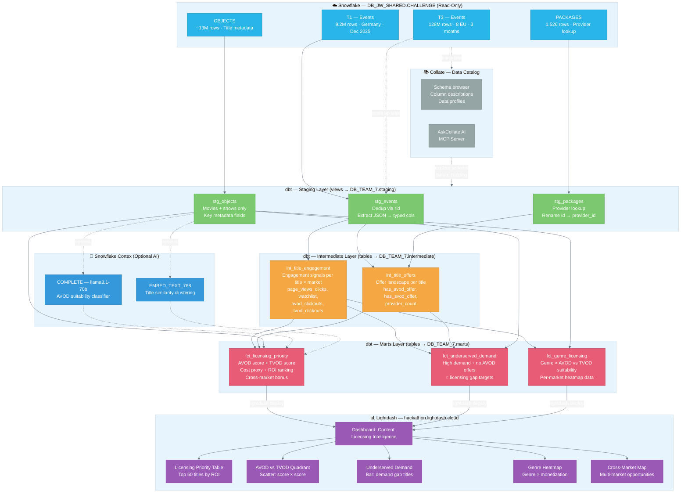
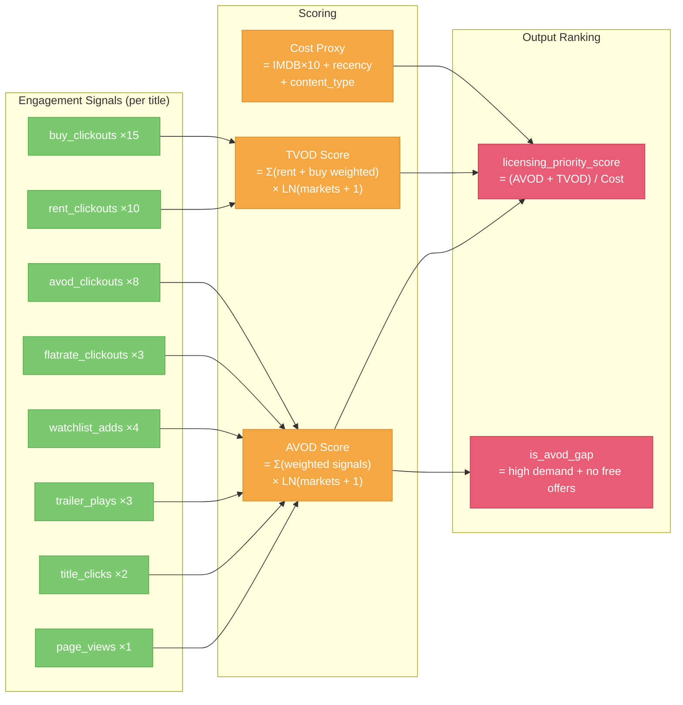
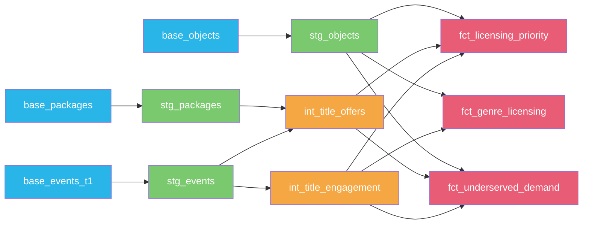

# Challenge 6: Content Licensing Intelligence — Architecture

Data pipeline for ranking JustWatch titles by AVOD and TVOD revenue potential, identifying underserved demand gaps, and surfacing cross-market licensing opportunities.

**Team:** 7 | **Warehouse:** `WH_TEAM_7_XS` | **Database:** `DB_TEAM_7`

---

## Full Architecture



---

## Scoring Model



---

## Data Lineage (dbt model dependencies)



---

## Running the Pipeline

```bash
# 1. Set warehouse
snow sql -q "USE WAREHOUSE WH_TEAM_7_XS" -c hackathon

# 2. Run all models (T1 — Germany prototype)
cd platforms/dbt/dbt_template
dbt run

# 3. Spot-check the priority ranking
snow sql -q "SELECT * FROM DB_TEAM_7.marts.fct_licensing_priority ORDER BY licensing_priority_score DESC LIMIT 20" -c hackathon --format json

# 4. Check underserved demand titles
snow sql -q "SELECT * FROM DB_TEAM_7.marts.fct_underserved_demand ORDER BY demand_gap_rank LIMIT 20" -c hackathon --format json

# 5. Deploy to Lightdash
lightdash deploy

# 6. Scale up: edit stg_events.sql, change base_events_t1 → base_events_t3
#    Then re-run with a larger warehouse:
snow sql -q "USE WAREHOUSE WH_TEAM_7_S" -c hackathon
dbt run --select stg_events+
```

---

## Lightdash Dashboard Specs

| Chart | Type | X | Y | Color/Size |
|-------|------|---|---|------------|
| Licensing Priority Table | Table | title | avod_score, tvod_score, licensing_priority_score | object_type |
| AVOD vs TVOD Quadrant | Scatter | avod_score | tvod_score | object_type / unique_users |
| Underserved Demand | Bar (horizontal) | demand gap rank | title | — |
| Genre Heatmap | Heatmap / Table | genre | avod_roi vs tvod_roi | — |
| Cross-Market Opportunities | Bar | market_count | title | object_type |
